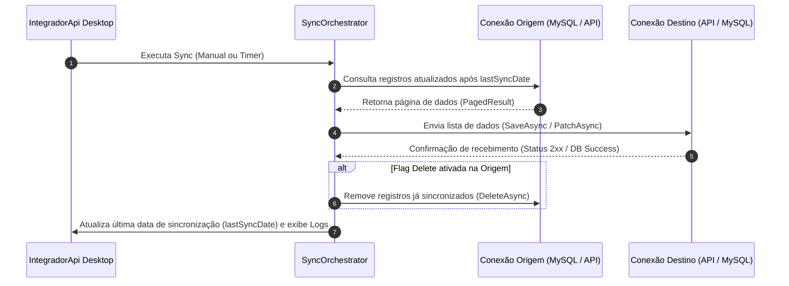

# IntegradorApi 🔄

O **IntegradorApi** é uma solução desktop desenvolvida em **.NET 8 (WinUI 3 / Windows App SDK)** projetada para orquestrar e automatizar a sincronização incremental de dados entre bancos de dados locais (ex.: MySQL) e serviços Web via **API REST** ou entre instâncias distribuídas de bancos de dados.

---

## 📌 Sumário
- [Arquitetura do Projeto](#-arquitetura-do-projeto)
- [Recursos e Funcionalidades](#-recursos-e-funcionalidades)
- [Tipos de Conexão e Integrações](#-tipos-de-conexao-e-integracoes)
- [Documentação Detalhada da API REST](#-documentacao-detalhada-da-api-rest)
  - [Autenticação e Saúde](#1-autenticacao-e-saude)
  - [Manga Extractor](#2-manga-extractor)
  - [Novel Extractor](#3-novel-extractor)
  - [Deck Subtitle](#4-deck-subtitle)
  - [Comic Info](#5-comic-info)
  - [Texto Inglês](#6-texto-ingles)
  - [Texto Japonês](#7-texto-japones)
- [Estrutura de Dados e Paginação](#-estrutura-de-dados-e-paginacao)
- [Fluxo de Sincronização](#-fluxo-de-sincronizacao)
- [Configuração e Execução](#-configuracao-e-execucao)

---

## 🏗️ Arquitetura do Projeto

A solução está dividida em 4 projetos principais:

| Projeto | Tecnologia / Responsabilidade |
| :--- | :--- |
| **`IntegradorApi`** | Interface Desktop WinUI 3 (XAML), bandeja do sistema (System Tray), console de logs em tempo real via Serilog Event Bus, agendador automático via Timer. |
| **`IntegradorApi.Api`** | Camada de comunicação REST HTTP (`HttpClient`, gerenciamento de JWT Token Bearer com `ApiAuthManager`, e serviços REST especializados). |
| **`IntegradorApi.Data`** | Camada de persistência de dados (`EF Core`, `AppDbContext`, repositórios JDBC/MySQL, migrations e modelos de entidades). |
| **`IntegradorApi.Sync`** | Motor de orquestração de sincronização (`SyncOrchestrator`), mapeamentos AutoMapper e sincronizadores de Origem (`ORIGIN`) para Destino (`DESTINATION`). |

---

## 🚀 Recursos e Funcionalidades

- **Sincronização Incremental**: Utiliza marcas temporais (`lastSyncDate`) para buscar apenas registros modificados a partir da última sincronização bem-sucedida.
- **Autenticação Automática JWT**: Login automático em APIs REST via `/auth/signin` com renovação e injeção do cabeçalho `Authorization: Bearer <token>`.
- **Paginação Configurável**: Consultas paginadas por padrão (tamanho de página padrão = `20` registros).
- **Interface Desktop Moderna**: Design WinUI 3 com efeito visual *Mica Backdrop*, monitor de status visual das conexões (Verde / Amarelo / Vermelho) e atalho para minimizar na bandeja do sistema (System Tray).
- **Execução Automática e Manual**: Suporte a temporizador automático em segundo plano (delay inicial de 10 min, intervalo de 3 horas) ou execução manual sob demanda.
- **Deleção Opcional de Origem**: Flag de configuração (`Delete`) para mover/remover dados do banco de origem após sincronização confirmada no destino.
- **Console de Logs Integrado**: Visualização imediata dos eventos do Serilog na própria janela do aplicativo.

---

## 🔌 Tipos de Conexão e Integrações

### Tipos de Conexão (`ConnectionType`)
1. `APIREST`: Conexão HTTP com endpoints REST.
2. `MYSQL`: Conexão direta com banco de dados MySQL via JDBC / EF Core.
3. `POSTGRESSQL`: Conexão com banco PostgreSQL (*em implementação*).

### Modos de Conexão (`DataSourceType`)
- `ORIGIN`: Fonte de dados de onde os registros são lidos.
- `DESTINATION`: Destino para onde os registros são gravados/atualizados.

### Módulos de Integração Suportados (`IntegrationType`)
1. `MANGA_EXTRACTOR`
2. `NOVEL_EXTRACTOR`
3. `DECKSUBTITLE`
4. `COMICINFO`
5. `TEXTO_INGLES`
6. `TEXTO_JAPONES`

---

## 📡 Documentação Detalhada da API REST

### 1. Autenticação e Saúde

#### Health Check
- **Endpoint**: `GET /health`
- **Descrição**: Utilizado para testar se a API REST está ativa.
- **Resposta**: `200 OK` (Body: `text/plain` com status da aplicação).

#### Login / Autenticação JWT
- **Endpoint**: `POST /auth/signin`
- **Headers**: `Content-Type: application/json`
- **Request Body**:
  ```json
  {
    "username": "seu_usuario",
    "password": "sua_senha"
  }
  ```
- **Response Body**:
  ```json
  {
    "authenticated": true,
    "accessToken": "eyJhbGciOi...",
    "refreshToken": "...",
    "expiration": "2026-08-30T12:00:00Z",
    "username": "seu_usuario"
  }
  ```

---

### 2. Manga Extractor

- **Listar Tabelas**: `GET /api/manga-extractor/tabelas`
- **Buscar Atualizações**: `GET /api/manga-extractor/tabela/{tableName}/atualizacao/{lastUpdate}?page=0&size=20&direction=asc`
  - *lastUpdate format*: `yyyy-MM-ddTHH:mm:ss`
- **Enviar Registros (Batch Insert/Patch)**: `PATCH /api/manga-extractor/tabela/{tableName}/lista`
- **Deletar Registros (Batch Delete)**: `DELETE /api/manga-extractor/tabela/{tableName}/lista`

---

### 3. Novel Extractor

- **Listar Tabelas**: `GET /api/novel-extractor/tabelas`
- **Buscar Atualizações**: `GET /api/novel-extractor/tabela/{tableName}/atualizacao/{lastUpdate}?page=0&size=20&direction=asc`
- **Enviar Registros (Batch Insert/Patch)**: `PATCH /api/novel-extractor/tabela/{tableName}/lista`
- **Deletar Registros (Batch Delete)**: `DELETE /api/novel-extractor/tabela/{tableName}/lista`

---

### 4. Deck Subtitle

- **Listar Tabelas**: `GET /api/deck-subtitle/tabelas`
- **Buscar Atualizações**: `GET /api/deck-subtitle/tabela/{tableName}/atualizacao/{lastUpdate}?page=0&size=20&direction=asc`
- **Enviar Registros (Batch Insert/Patch)**: `PATCH /api/deck-subtitle/tabela/{tableName}/lista`
- **Deletar Registros (Batch Delete)**: `DELETE /api/deck-subtitle/tabela/{tableName}/lista`

---

### 5. Comic Info

- **Buscar Atualizações**: `GET /api/comic-info/atualizacao/{lastUpdate}?page=0&size=20&direction=asc`
- **Enviar Registros (Batch Insert/Patch)**: `PATCH /api/comic-info/lista`
- **Deletar Registros (Batch Delete)**: `DELETE /api/comic-info/lista`

---

### 6. Texto Inglês

Possui 4 sub-módulos (`exclusao`, `revisar`, `valido`, `vocabulario`).

Para cada sub-módulo `{modulo}`:
- **Buscar Atualizações**: `GET /api/texto-ingles/{modulo}/atualizacao/{lastUpdate}?page=0&size=20&direction=asc`
- **Enviar Registros (Batch Insert/Patch)**: `PATCH /api/texto-ingles/{modulo}/lista`
- **Deletar Registros (Batch Delete)**: `DELETE /api/texto-ingles/{modulo}/lista`

---

### 7. Texto Japonês

Possui 6 sub-módulos (`estatistica`, `exclusao`, `kanjax-pt`, `kanji-info`, `revisar`, `vocabulario`).

Para cada sub-módulo `{modulo}`:
- **Buscar Atualizações**: `GET /api/texto-japones/{modulo}/atualizacao/{lastUpdate}?page=0&size=20&direction=asc`
- **Enviar Registros (Batch Insert/Patch)**: `PATCH /api/texto-japones/{modulo}/lista`
- **Deletar Registros (Batch Delete)**: `DELETE /api/texto-japones/{modulo}/lista`

---

## 📄 Estrutura de Dados e Paginação

Todas as chamadas de busca por atualização retornam o tipo genérico `PagedApiResponse<T>`:

```json
{
  "content": [ ... ],
  "pageable": {
    "pageNumber": 0,
    "pageSize": 20
  },
  "totalPages": 5,
  "totalElements": 95,
  "last": false
}
```

---

## 🔄 Fluxo de Sincronização



---

## ⚙️ Configuração e Execução

### Pré-requisitos
- **.NET 8.0 SDK** com suporte a Windows Desktop App SDK / WinUI 3.
- Servidor **MySQL** acessível para armazenar as configurações locais e tabelas de dados.

### Configuração do Banco Local (`appsettings.json`)
Crie ou edite o arquivo `appsettings.json` na raiz da aplicação desktop:

```json
{
  "ConnectionStrings": {
    "LocalDatabase": {
      "Description": "Banco de Dados Local",
      "Address": "localhost",
      "Port": "3306",
      "User": "seu_usuario",
      "Password": "sua_senha"
    }
  },
  "AppSettings": {
    "Sincronizar": true
  }
}
```

### Compilando e Executando
```bash
# Restaurar dependências
dotnet restore

# Compilar a solução
dotnet build IntegradorApi.sln -c Release

# Executar a aplicação Desktop
dotnet run --project IntegradorApi/IntegradorApi.csproj
```
