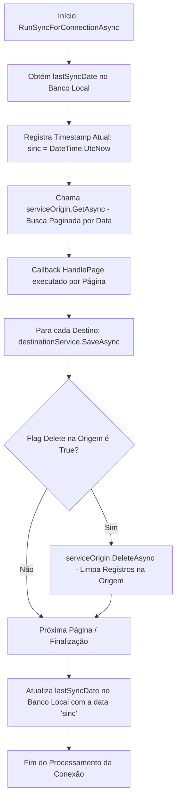

# Motor de Orquestração e Sincronização - SyncEngine_and_Orchestration

## 🎯 Objetivo / Contexto

O projeto `IntegradorApi.Sync` é o núcleo de orquestração de transferência de dados da solução. Ele desacopla as fontes de dados de origem (`ORIGIN`) e os destinos (`DESTINATION`), permitindo sincronizar de MySQL para REST API, de REST API para MySQL, ou de MySQL para MySQL de forma totalmente transparente e desacoplada.

## 🧩 Arquivos e Componentes

- **`Services/SyncOrchestrator.cs`**: Orquestrador principal responsável por carregar conexões, parear origens com destinos do mesmo tipo de integração e coordenar a execução lote a lote.
- **`Interfaces/ISyncService<T>`**: Interface genérica que define os contratos de busca (`GetAsync`), salvamento (`SaveAsync`) e deleção (`DeleteAsync`).
- **`Services/SyncServiceBase.cs`**: Classe abstrata base para serviços de sincronização.
- **`Services/SyncApiServiceBase.cs`**: Implementação base para serviços que interagem com a API REST.
- **`Services/SyncDataServiceBase.cs`**: Implementação base para serviços que interagem diretamente com banco de dados MySQL via DAOs/EF Core.
- **`Mappings/`**: Perfis AutoMapper que convertem DTOs da API REST em Entidades do banco de dados e vice-versa:
  - `MangaMappingProfile.cs`
  - `NovelMappingProfile.cs`
  - `DeckSubtitleMappingProfile.cs`
  - `ComicInfoMappingProfile.cs`

## ⚙️ Fábrica de Serviços de Sincronização (`GetService<T>`)

O `SyncOrchestrator` utiliza um método factory interno para instanciar dinamicamente o serviço correto de acordo com a tecnologia e integração da conexão:

```csharp
switch (connection.TypeConnection) {
    case ConnectionType.MYSQL:
        return connection.TypeIntegration switch {
            IntegrationType.MANGA_EXTRACTOR => new MangaDataSyncService(connection, _logger),
            IntegrationType.NOVEL_EXTRACTOR => new NovelDataSyncService(connection, _logger),
            IntegrationType.DECKSUBTITLE    => new DeckSubtitleDataSyncService(connection, _logger),
            IntegrationType.COMICINFO       => new ComicInfoDataSyncService(connection, _logger),
            _ => throw new InvalidOperationException()
        };
    case ConnectionType.APIREST:
        return connection.TypeIntegration switch {
            IntegrationType.MANGA_EXTRACTOR => new MangaApiSyncService(connection, _logger),
            IntegrationType.NOVEL_EXTRACTOR => new NovelApiSyncService(connection, _logger),
            IntegrationType.DECKSUBTITLE    => new DeckSubtitleApiSyncService(connection, _logger),
            IntegrationType.COMICINFO       => new ComicInfoApiSyncService(connection, _logger),
            _ => throw new InvalidOperationException()
        };
}
```

## 🔄 Fluxo Detalhado da Execução (`RunSyncForConnectionAsync`)



### Regras de Negócio Importantes
1. **Iteração por Tabelas**: Para integrações que possuem múltiplas tabelas dinâmicas (`MangaExtractor`, `NovelExtractor`, `DeckSubtitle`), o serviço obtém primeiro a lista de tabelas (`GetTablesAsync`) e itera sobre cada uma executando o ciclo de busca e gravação paginada.
2. **Deleção na Origem (`connection.Delete`)**: Quando ativada, a remoção só é executada **após** a confirmação bem-sucedida da gravação em todos os destinos ativos.
3. **Persistência do Timestamp**: A data da última sincronização é gravada somente ao concluir todo o ciclo sem erros críticos, garantindo resiliência em caso de falhas de rede.
